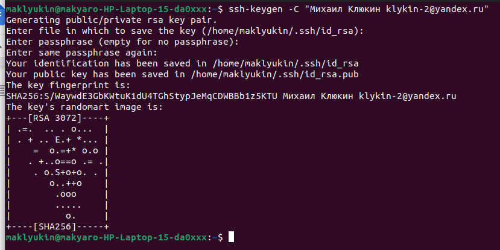
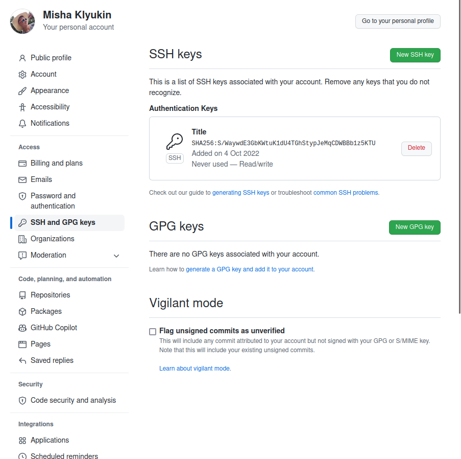
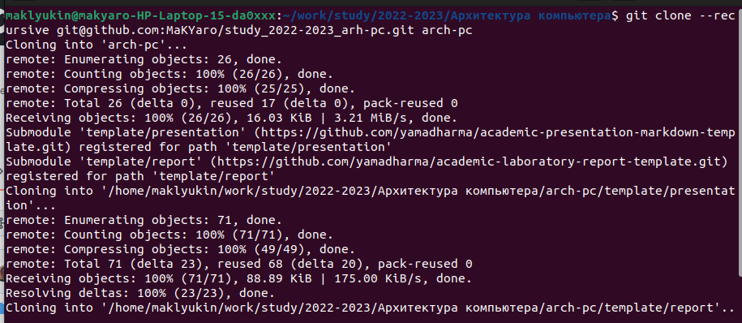
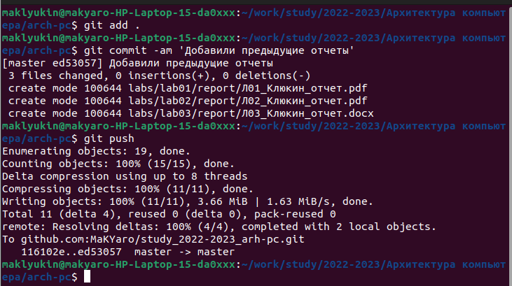

---
## Front matter
title: "Лабораторная работа № 3"
subtitle: "дисциплина: Архитектура компьютера"
author: "Клюкин Михаил Александрович"

## Generic otions
lang: ru-RU
toc-title: "Содержание"

## Bibliography
bibliography: bib/cite.bib
csl: pandoc/csl/gost-r-7-0-5-2008-numeric.csl

## Pdf output format
toc: true # Table of contents
toc-depth: 2
lof: true # List of figures
lot: true # List of tables
fontsize: 12pt
linestretch: 1.5
papersize: a4
documentclass: scrreprt
## I18n polyglossia
polyglossia-lang:
  name: russian
  options:
	- spelling=modern
	- babelshorthands=true
polyglossia-otherlangs:
  name: english
## I18n babel
babel-lang: russian
babel-otherlangs: english
## Fonts
mainfont: PT Serif
romanfont: PT Serif
sansfont: PT Sans
monofont: PT Mono
mainfontoptions: Ligatures=TeX
romanfontoptions: Ligatures=TeX
sansfontoptions: Ligatures=TeX,Scale=MatchLowercase
monofontoptions: Scale=MatchLowercase,Scale=0.9
## Biblatex
biblatex: true
biblio-style: "gost-numeric"
biblatexoptions:
  - parentracker=true
  - backend=biber
  - hyperref=auto
  - language=auto
  - autolang=other*
  - citestyle=gost-numeric
## Pandoc-crossref LaTeX customization
figureTitle: "Рис."
tableTitle: "Таблица"
listingTitle: "Листинг"
lofTitle: "Список иллюстраций"
lotTitle: "Список таблиц"
lolTitle: "Листинги"
## Misc options
indent: true
header-includes:
  - \usepackage{indentfirst}
  - \usepackage{float} # keep figures where there are in the text
  - \floatplacement{figure}{H} # keep figures where there are in the text
---

# Цель работы

Целью работы является изучить идеологию и применение средств контроля версий. Приобрести практические навыки по работе с системой git.

# Задание

1. Настройка github.
2. Базовая настройка git.
3. Создание SSH ключа.
4. Создание рабочего пространства и репозитория курса на основе шаблона.
5. Создание репозитория курса на основе шаблона.
6. Настройка каталога курса.
7. Задания для самостоятельной работы.

# Теоретическое введение

## Системы контроля версий. Общие понятия

Системы контроля версий (Version Control System, VCS) применяются при работе нескольких человек над одним проектом. Обычно основное дерево проекта хранится в локальном или удалённом репозитории, к которому настроен доступ для участников проекта. При внесении изменений в содержание проекта система контроля версий позволяет их фиксировать, совмещать изменения, произведённые разными участниками проекта, производить откат к любой более ранней версии проекта, если это требуется.

В классических системах контроля версий используется централизованная модель, предполагающая наличие единого репозитория для хранения файлов. Выполнение большинства функций по управлению версиями осуществляется специальным сервером. Участник проекта (пользователь) перед началом работы посредством определённых команд получает нужную ему версию файлов. После внесения изменений, пользователь размещает новую версию в хранилище. При этом предыдущие версии не удаляются из центрального хранилища и к ним можно вернуться в любой момент. Сервер может сохранять не полную версию изменённых файлов, а производить так называемую дельта-компрессию — сохранять только изменения между последовательными версиями, что позволяет уменьшить объём хранимых данных.

Системы контроля версий поддерживают возможность отслеживания и разрешения конфликтов, которые могут возникнуть при работе нескольких человек над одним файлом. Можно объединить (слить) изменения, сделанные разными участниками (автоматически или вручную), вручную выбрать нужную версию, отменить изменения вовсе или заблокировать файлы для изменения. В зависимости от настроек блокировка не позволяет другим пользователям получить рабочую копию или препятствует изменению рабочей копии файла средствами файловой системы ОС, обеспечивая таким образом, привилегированный доступ только одному пользователю, работающему с файлом.

Системы контроля версий также могут обеспечивать дополнительные, более гибкие функциональные возможности. Например, они могут поддерживать работу с несколькими версиями одного файла, сохраняя общую историю изменений до точки ветвления версий и собственные истории изменений каждой ветви. Кроме того, обычно доступна информация о том, кто из участников, когда и какие изменения вносил. Обычно такого рода информация хранится в журнале изменений, доступ к которому можно ограничить.

В отличие от классических, в распределённых системах контроля версий центральный репозиторий не является обязательным.

Среди классических VCS наиболее известны CVS, Subversion, а среди распределённых — Git, Bazaar, Mercurial. Принципы их работы схожи, отличаются они в основном синтаксисом используемых в работе команд.

## Система контроля версий Git

Система контроля версий Git представляет собой набор программ командной троки. Доступ к ним можно получить из терминала посредством ввода команды git с различными опциями. 

Благодаря тому, что Git является распределённой системой контроля версий, резервную копию локального хранилища можно сделать простым копированием или архивацией.

## Основные команды git

git init – создание основного дерева репозитория 
git pull – получение обновлений текущего дерева из центрального репозитория 
git push – отправка всех произведённых изменений локального дерева в центральный репозиторий 
git status – просмотр списка изменённых файлов в текущей директории 
git diff – просмотр текущих изменения 
git add . – добавить все изменённые и/или созданные файлы и/или каталоги 
git add имена_файлов – добавить конкретные изменённые и/или созданные файлы и/или каталоги 
git rm имена_файлов – удалить файл и/или каталог из индекса репозитория (при этом файл и/или каталог остаётся в локальной директории) 
git commit -am ‘Описание коммита’ – сохранить все добавленные изменения и все изменённые файлы 
git checkout -b имя_ветки – создание новой ветки, базирующейся на текущей 
git checkout имя_ветки – переключение на некоторую ветку (при переключении на ветку, которой ещё нет в локальном репозитории, она будет создана и связана с удалённой) 
git push origin имя_ветки – отправка изменений конкретной ветки в центральный репозиторий 
git merge --no-ff имя_ветки – слияние ветки с текущим деревом 
git branch -d имя_ветки – удаление локальной уже слитой с основным деревом ветки 
git branch -D имя_ветки – принудительное удаление локальной ветки 
git push origin :имя_ветки – удаление ветки с центрального репозитория 

## Стандартные процедуры при наличии центрального репозитория

Работа пользователя со своей веткой начинается с проверки и получения изменений из центрального репозитория (при этом в локальное дерево до начала этой процедуры не должно было вноситься изменений):
git checkout master 
git pull 
git checkout -b имя_ветки 

Затем можно вносить изменения в локальном дереве и/или ветке.

После завершения внесения какого-то изменения в файлы и/или каталоги проекта необходимо разместить их в центральном репозитории. Для этого необходимо проверить, какие файлы изменились к текущему моменту:
git status 
и при необходимости удаляем лишние файлы, которые не хотим отправлять в центральный репозиторий. 

Затем полезно просмотреть текст изменений на предмет соответствия правилам ведения чистых коммитов:
git diff 
Если какие-либо файлы не должны попасть в коммит, то помечаем только те файлы, изменения которых нужно сохранить. Для этого используем команды добавления и/или удаления с нужными опциями:
git add имена_файлов 
git rm имена_файлов 

Если нужно сохранить все изменения в текущем каталоге, то используем: 
git add . 

Затем сохраняем изменения, поясняя, что было сделано: 
git commit -am "Some commit message" 
и отправляем в центральный репозиторий: 
git push origin имя_ветки 
или 
git push 

# Выполнение лабораторной работы

## Насторйка github

Создали учетную запись на сайте https://github.com/ и заполнили основные данные.

## Базовая настройка git

Сделали предварительную конфигурацию git: открыли терминал и ввели следующие команды, указав имя и email владельца репозитория (Рис. 1):

git config - -global user.name “<Name Surname>”

git config - -global user.email “<work@email>”

Настроили utf-8 в выводе сообщений git (Рис. [-@fig:fig1]):

git config - -global core.quotepath false

Задали имя начальной ветки master (Рис. [-@fig:fig1]):

git config --global init.defaultBranch master

Задали параметр autocrlf (Рис. [-@fig:fig1]):

git config --global core.autocrlf input

Задали параметр safecrlf (Рис. [-@fig:fig1]):

git config --global core.safecrlf warn

{ #fig:fig1 width=70% }

## Создание SSH ключа

Сгенерировали пару ключей – приватный и открытый (Рис. [-@fig:fig2]):

ssh-keygen -C "Имя Фамилия <work@mail>"

{ #fig:fig2 width=70% }

Скопировали из локальной консоли ключ в буфер обмена (Рис. [-@fig:fig3]):

cat ~/.ssh/id_rsa.pub | xclip -sel clip

{ #fig:fig3 width=70% }

Загрузили сгенерированный открытый ключ: зашли на сайт https://github.org/ под своей учетной записью и перешли в меню Settings, в боковом меню выбрали SSH and GPG keys и нажали кнопку New SSH key, вставили ключ в появившемся на сайте поле и указали имя для ключа – Title (Рис. [-@fig:fig4]).

{ #fig:fig4 width=70% }

## Создание рабочего пространства и репозитория курса на основе шаблона

С помощью терминала создали каталог для предмета “Архитектура компьютера” (Рис. [-@fig:fig5]):

mkdir -p ~/work/study/2022-2023/"Архитектура компьютера"

{ #fig:fig5 width=70% }

## Создание репозитория курса на основе шаблона

Перешли на страницу репозитория с шаблоном курса https://github.com/yam
adharma/course-directory-student-template, выбрали Use this template, в открывшемся окне задали имя репозитория study_2022–2023_arh-pc и создали репозиторий (Рис. [-@fig:fig6]).

{ #fig:fig6 width=70% }

В терминале перешли в каталог курса (Рис. [-@fig:fig7]):

cd ~/work/study/2022-2023/"Архитектура компьютера"

{ #fig:fig7 width=70% }

Склонировали созданный репозиторий (Рис. [-@fig:fig8]):
```
git clone --recursive git@github.com:<user_name>/study_2022–2023_arh-pc.git arch-pc
```
{ #fig:fig8 width=70% }

## Настройка каталога курса

Перешли в каталог курса (Рис. [-@fig:fig9]):

cd ~/work/study/2022-2023/"Архитектура компьютера"/arch-pc

Удалили лишние файлы (Рис. [-@fig:fig9]):

rm package.json

Создали необходимые каталоги (Рис. [-@fig:fig9]):

echo arch-pc > COURSE
make

{ #fig:fig9 width=70% }

Отправили файлы на сервер (Рис. [-@fig:fig10], [-@fig:fig11]):

git add .
git commit -am 'feat(main): make course structure'
git push

{ #fig:fig10 width=70% }

{ #fig:fig11 width=70% }

Проверили правильность создания иерархии рабочего пространства в локальном репозитории и на странице github.

## Задание для самостоятельной работы

Создали отчет о выполнении лабораторной работы в соответствующем каталоге рабочего пространства – labs/lab03/report (Рис. [-@fig:fig12]).

{ #fig:fig12 width=70% }

Скопировали отчеты по выполнению предыдущих лабораторных в соответствующие каталоги созданного рабочего пространства (Рис. [-@fig:fig13]).

{ #fig:fig13 width=70% }

Загрузили файлы на github (Рис. [-@fig:fig14]).

{ #fig:fig14 width=70% }


# Выводы

Изучили идеологию и применение средств контроля версий. Приобрели практические навыки по работе с системой git.

# Список литературы{.unnumbered}

::: Демидова А. В. Лабораторная работа №3. Система контроля версий Git – Методическое пособие{#refs}
:::
