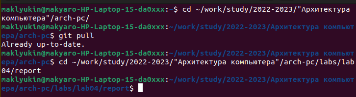
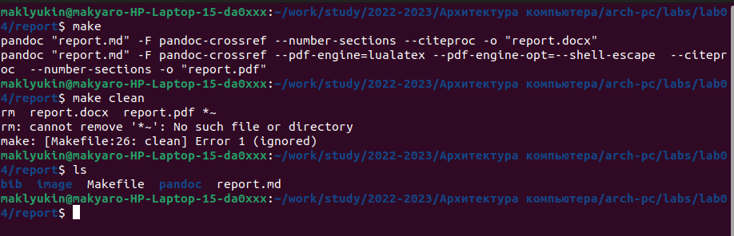

---
## Front matter
title: "Отчет по лабораторной работе № 3"
subtitle: "дисциплина: Архитектура компьютера"
author: "Клюкин Михаил Александрович"

## Generic otions
lang: ru-RU
toc-title: "Содержание"

## Bibliography
bibliography: bib/cite.bib
csl: pandoc/csl/gost-r-7-0-5-2008-numeric.csl

## Pdf output format
toc: true # Table of contents
toc-depth: 2
lof: true # List of figures
lot: true # List of tables
fontsize: 12pt
linestretch: 1.5
papersize: a4
documentclass: scrreprt
## I18n polyglossia
polyglossia-lang:
  name: russian
  options:
	- spelling=modern
	- babelshorthands=true
polyglossia-otherlangs:
  name: english
## I18n babel
babel-lang: russian
babel-otherlangs: english
## Fonts
mainfont: PT Serif
romanfont: PT Serif
sansfont: PT Sans
monofont: PT Mono
mainfontoptions: Ligatures=TeX
romanfontoptions: Ligatures=TeX
sansfontoptions: Ligatures=TeX,Scale=MatchLowercase
monofontoptions: Scale=MatchLowercase,Scale=0.9
## Biblatex
biblatex: true
biblio-style: "gost-numeric"
biblatexoptions:
  - parentracker=true
  - backend=biber
  - hyperref=auto
  - language=auto
  - autolang=other*
  - citestyle=gost-numeric
## Pandoc-crossref LaTeX customization
figureTitle: "Рис."
tableTitle: "Таблица"
listingTitle: "Листинг"
lofTitle: "Список иллюстраций"
lotTitle: "Список таблиц"
lolTitle: "Листинги"
## Misc options
indent: true
header-includes:
  - \usepackage{indentfirst}
  - \usepackage{float} # keep figures where there are in the text
  - \floatplacement{figure}{H} # keep figures where there are in the text
---

# Цель работы

Освоить процедуру оформления отчетов с помощью легковесного языка разметки Markdown. 

# Задание

1. Установить TeX Live, Pandoc и Pandoc-crossref.
2. Скомпилировать шаблон отчета с помощью Makefile.
3. Заполнить и скомпилировать отчет, используя Makefile.
4. Загрузить файлы на Github.
5. Выполнить задания для самостоятельной работы

# Теоретическое введение

## Базовые сведения о Markdown

Чтобы создать заголовок, используйте знак #, например:

```
# This is heading 1
## This is heading 2
### This is heading 3
#### This is heading 4
```

Чтобы задать для текста полужирное начертание, заключите его в двойные
звездочки:

This text is **bold**.

Чтобы задать для текста курсивное начертание, заключите его в одинарные
звездочки:

This text is ``` *italic* ```.

Чтобы задать для текста полужирное и курсивное начертание, заключите его
в тройные звездочки:

This is text is both ***bold and italic***.

Блоки цитирования создаются с помощью символа >:

> The drought had lasted now for ten million years, and the reign of
the terrible lizards had long since ended. Here on the Equator,
in the continent which would one day be known as Africa, the
battle for existence had reached a new climax of ferocity, and
the victor was not yet in sight. In this barren and desiccated
land, only the small or the swift or the fierce could flourish,
or even hope to survive.

Упорядоченный список можно отформатировать с помощью соответствую-
щих цифр:

1.	First instruction
	1.	Sub-instruction
	1.	Sub-instruction
1.	Second instruction

Чтобы вложить один список в другой, добавьте отступ для элементов дочер-
него списка:

1.	First instruction
1.	Second instruction
1.	Third instruction

Неупорядоченный (маркированный) список можно отформатировать с помо-
щью звездочек или тире:

* List item 1
* List item 2
* List item 3

Чтобы вложить один список в другой, добавьте отступ для элементов дочер-
него списка:

- List item 1
	- List item A
	- List item B
- List item 2

Синтаксис Markdown для встроенной ссылки состоит из части $[link text]$,
представляющей текст гиперссылки, и части (file-name.md) – URL-адреса или
имени файла, на который дается ссылка.

Markdown поддерживает как встраивание фрагментов кода в предложение,
так и их размещение между предложениями в виде отдельных огражденных
блоков. Огражденные блоки кода — это простой способ выделить синтаксис для
фрагментов кода. Общий формат огражденных блоков кода:

``` language
your code goes in here
```

## Оформление формул в Markdown

Внутритекстовые формулы делаются аналогично формулам LaTeX. Например,
формула $sin^2 (x) + cos^2 (x) = 1$ запишется как
```
$\sin^2 (x) + \cos^2 (x) = 1$
```

Выключение формулы:

$$
\sin^2 (x) + \cos^2 (x) = 1
$$ {#eq:eq1}

со ссылкой в тексте «Смотри формулу ({-eq. 4.1}).» записывается как
```
$$
\sin^2 (x) + \cos^2 (x) = 1
$$ {#eq:eq1}
```
Смотри формулу (`[-@eq:eq1]`).

## Оформление изображений в Markdown

В Markdown вставить изображение в документ можно с помощью непосред-
ственного указания адреса изображения. Синтаксис данной команды выглядит
следующим образом:

```{ #fig:fig1 width=70% }
```

Здесь:

* в квадратных скобках указывается подпись к изображению;
* в круглых скобках указывается URL-адрес или относительный путь изоб-
ражения, а также (необязательно) всплывающую подсказку, заключённую
в двойные или одиночные кавычки.
* в фигурных скобках указывается идентификатор изображения (#fig:fig1)
для ссылки на него по тексту и размер изображения относительно ширины
страницы (width=90%)

Ссылка на изображение может быть оформлена следующим образом
```(рис. [-@fig:fig1])
```

## Обработка файлов в формате Markdown

Преобразовать файл README.md можно следующим образом:

pandoc README.md -o README.pdf

или так

pandoc README.md -o README.docx

# Выполнение лабораторной работы

Открыли терминал и перешли в каталог курса (Рис. [-@fig:fig1]): 

cd ~/work/study/2022-2023/"Архитектура компьютера"/arch-pc/

Обновили локальный репозиторий, скачав изменения из удаленного репозитория (Рис. [-@fig:fig1]):

git pull

Перешли в каталог с шаблоном отчета по лабораторной работе № 4 (Рис. [-@fig:fig1]):

cd ~/work/study/2022-2023/"Архитектуракомпьютера"/arch-pc/labs/lab04/report

{ #fig:fig1 width=70% }

Провели компиляцию шаблона с использованием Makefile с помощью команды *make*. Открыли файлы report.pdf и report.docx, проверили их корректность. Удалили полученные файлы командой *make clean* (Рис. [-@fig:fig2]).

Проверили, что после этой команды файлы report.pdf и report.docx были удалены (Рис. [-@fig:fig2]).

{ #fig:fig2 width=70% }

Открыли файл с помощью текстового редактора gedit. 

Заполнили отчет и скомпилировали его с помощью Makefile

Загрузили файлы на Github.

# Выполнение заданий для самостоятельной работы

В соответсвующем каталоге сделали отчет по лабораторной работе № 3 в формате Markdown. 

Загрузили файлы на Github.

# Контрольные вопросы для самопроверки

1. Что такое Markdown?

Markdown - это легковесный язык разметки.

2. Как в Markdown задается начертание шрифтов?

Для полужирного начертания текст заключают в двойные звездочки, для курсивного в одинарные, а для полужирного и курсивного начертания в тройные.

3. Как в Markdown оформляются списки

Упорядоченный список можно отформатировать с помощью соответсвующих цифр. Чтобы вложить один список в другой, нужно добавить отступ для элементов дочернего списка. Неупорядоченный список можно отформатировать с помощью звездочек и тире.

4. Как в Markdown оформляются изображения и ссылки на них?

В Markdown вставить изображение в документ можно с помощью непосредственного указания адреса изобржаения:

```[Подпись к рисунку](/путь/к/изображению.jpg "Необязательнаяподсказка"){ #fig:fig1 width=70% }
```

- в квадратных скобках - подпись к изображению
- в круглых скобках - URL-адрес или относительных путь изображения, а также всплывающая подсказка
- в фигурных скобках - идентификатор изображения для ссылки на него по тексту и размер изображения относительно ширины страницы

5. Как в Markdown оформляются математические формулы и ссылки на них?

Математические формулы в Markdown оформляются аналогично формулам Latex, например,

```$\sin^2 (x) + \cos^2 (x) = 1$
```

Ссылка на формулу указывается после самой формулы в фигурных скобках, например,

```$$
\sin^2 (x) + \cos^2 (x) = 1
$$ {#eq:eq1}
```

# Выводы

Освоили процедуру оформления отчетов с помощью легковесного языка разметки Markdown.

# Список литературы{.unnumbered}

::: Демидова А. В. Лабораторная работа №4. Язык разметки Markdown – Методическое пособие{#refs}
:::
