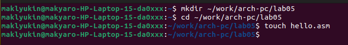
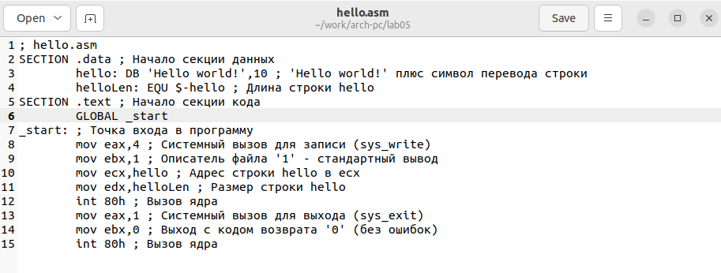
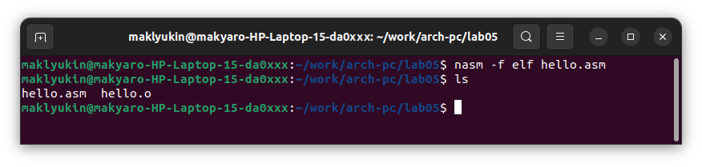
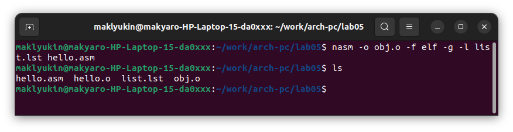
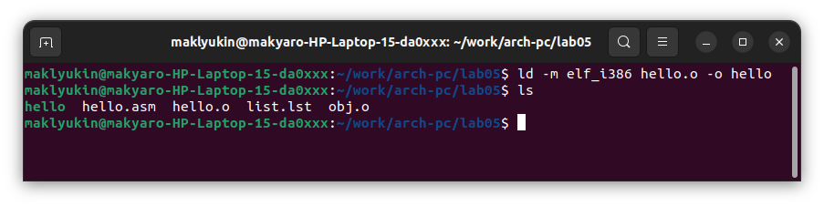
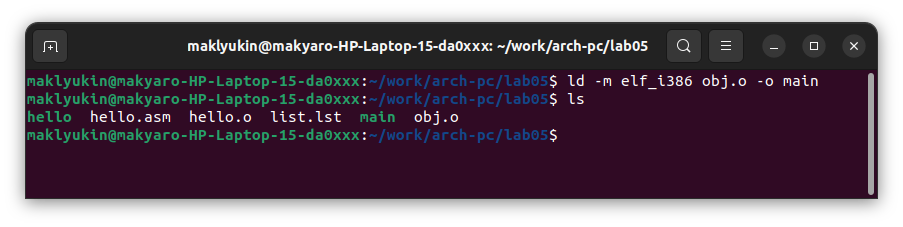
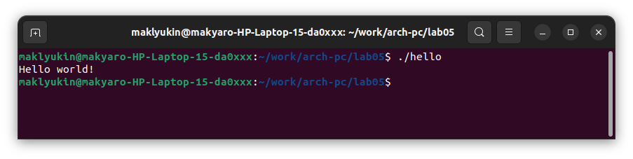
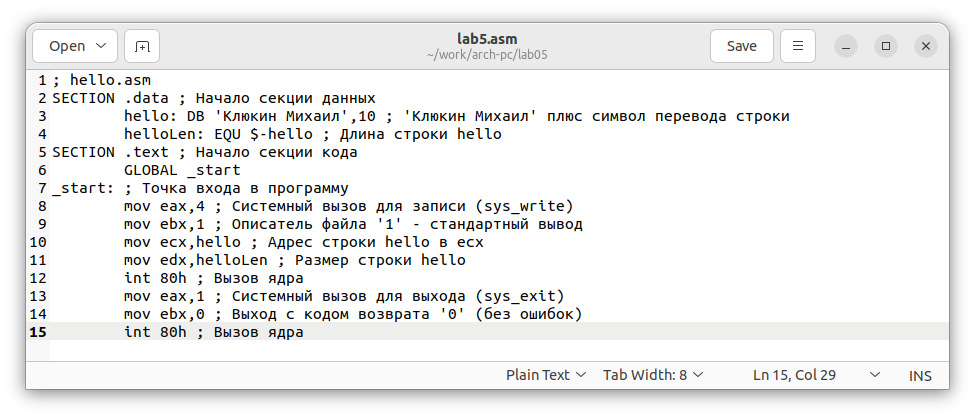
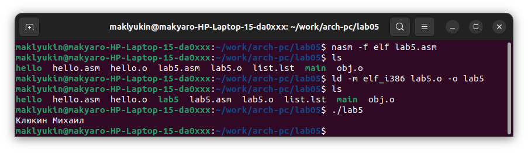
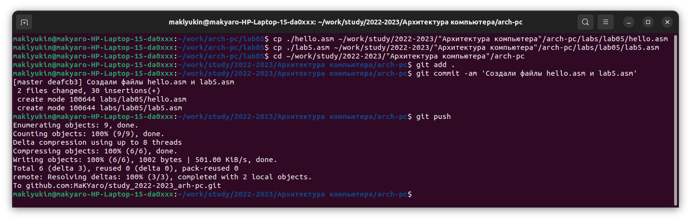

---
## Front matter
title: "Отчет по лабораторной работе № 5"
subtitle: "дисциплина: Архитектура компьютера"
author: "Клюкин Михаил Александрович"

## Generic otions
lang: ru-RU
toc-title: "Содержание"

## Bibliography
bibliography: bib/cite.bib
csl: pandoc/csl/gost-r-7-0-5-2008-numeric.csl

## Pdf output format
toc: true # Table of contents
toc-depth: 2
lof: true # List of figures
lot: true # List of tables
fontsize: 12pt
linestretch: 1.5
papersize: a4
documentclass: scrreprt
## I18n polyglossia
polyglossia-lang:
  name: russian
  options:
	- spelling=modern
	- babelshorthands=true
polyglossia-otherlangs:
  name: english
## I18n babel
babel-lang: russian
babel-otherlangs: english
## Fonts
mainfont: PT Serif
romanfont: PT Serif
sansfont: PT Sans
monofont: PT Mono
mainfontoptions: Ligatures=TeX
romanfontoptions: Ligatures=TeX
sansfontoptions: Ligatures=TeX,Scale=MatchLowercase
monofontoptions: Scale=MatchLowercase,Scale=0.9
## Biblatex
biblatex: true
biblio-style: "gost-numeric"
biblatexoptions:
  - parentracker=true
  - backend=biber
  - hyperref=auto
  - language=auto
  - autolang=other*
  - citestyle=gost-numeric
## Pandoc-crossref LaTeX customization
figureTitle: "Рис."
tableTitle: "Таблица"
listingTitle: "Листинг"
lofTitle: "Список иллюстраций"
lotTitle: "Список таблиц"
lolTitle: "Листинги"
## Misc options
indent: true
header-includes:
  - \usepackage{indentfirst}
  - \usepackage{float} # keep figures where there are in the text
  - \floatplacement{figure}{H} # keep figures where there are in the text
---

# Цель работы

Освоить процедуру компиляции и сборки программ, написанных на ассемблере NASM. 

# Задание

1. Написать программы, которая печатает на экран "Hello world!".
2. Провести трансляцию и компоновку этой программы.
3. Написать программу, которая печатает на экран "Клюкин Михаил".
4. Провести трасляцию и компоновку этой программы.
5. Скопировать полученные файлы в локальный репозиторий, загрузить их на Github.

# Теоретическое введение

## Основные принципы работы компьютера

Основными функциональными элементами ЭВМ являются центральный процессор, память и переферийные устройства. 
Взаимодействие этих устройств осуществляется через общую шину, которая представляет собой большое количество проводников,
соединяющих устройства друг с другом.

В состав центрального процессора входят следующие устройства:

- арифметико-логическое устройство;    
- устройство управления;   
- регистры.   

Для того, чтобы писать программы на ассемблере, необходимо знать, какие регистры процессора существуют и как их можно 
использовать. Большинство команд в программах написанных на ассемблере используют регистры в качестве операндов. Практически
все команды представляют собой преобразование данных хранящихся в регистрах процессора, это например пересылка данных
между регистрами или между регистрами и памятью, преобразование (арифметические или логические операции) данных хранящихся в регистрах.
Доступ к регистрам осуществляется не по адресам, как к основной памяти, а по именам. Каждый регистр процессора архитектуры 
x86 имеет свое название, состоящее из 2 или 3 букв латинского алфавита.

Примеры регистров общего назначения:

- RAX, RCX, RDX, RBX, RSI, RDI — 64-битные    
- EAX, ECX, EDX, EBX, ESI, EDI — 32-битные    
- AX, CX, DX, BX, SI, DI — 16-битные    
- AH, AL, CH, CL, DH, DL, BH, BL — 8-битные (половинки 16-битных регистров). Например, AH (high AX) — старшие 8 бит регистра AX, AL (low AX) —
младшие 8 бит регистра AX   

Другим важным узлом ЭВМ является оперативное запоминающее устройство (ОЗУ). ОЗУ — это быстродействующее энергозависимое 
запоминающее  устройство, которое напрямую взаимодействует с узлами процессора, предназначенное для хранения программ и 
данных, с которыми процессор непосредственно работает в текущий момент. ОЗУ состоит из одинаковых пронумерованных ячеек 
памяти. Номер ячейки памяти — это адрес хранящихся в ней данных.

В состав ЭВМ также входят периферийные устройства.

В основе вычислительного процесса ЭВМ лежит принцип программного управления. Это означает, что компьютер решает
поставленную задачу как последовательность действий, записанных в виде программы. Программа состоит из машинных команд, 
которые указывают, какие операции и над какими данными (или операндами), в какой последовательности необходимо выполнить.

При выполнении каждой команды процессор выполняет определённую последовательность стандартных действий, которая
называется командным циклом процессора. В самом общем виде он заключается в следующем:

1. формирование адреса в памяти очередной команды;
2. считывание кода команды из памяти и её дешифрация;
3. выполнение команды;
4. переход к следующей команде.

## Ассемблер и язык ассемблера

Ассемблер — машинноориентированный язык низкого уровня, который позволяет получить наиболее полный доступ к 
вычислительным ресурсам компьютера В современных архитектурах невозможно получить полный доступ к ресурсам компьютера. 
Самым низким уровнем работы программы является обращение напрямую к ядру ОС. Именно на этом уровне и работают программы, 
написанные на ассемблере.
Трансляция команд с языка ассемблера в исполняемый машинный код осуществляется специальной программой транслятором — ассемблером.

Открытый проект ассемблера. Его версии доступны под различные операционные системы. Он позволяет получать объектные 
файлы для этих систем. В NASM используется Intel-синтаксис и поддерживаются инструкции x86-64.

Формат записи команд NASM:
```
[метка:] мнемокод [операнд {, операнд}] [; комментарий]
```
Метка перед командой связана с адресом данной команды.  
Мнемокод — сама инструкция.  
Операндами могут быть числа, данные, адреса регистров, адреса оперативной памяти.  

В метках допустимы буквы, цифры, а также символы _, $, #, @, ~, ., ?. Метка может начинаться с буквы, ., _ или ?. Перед идентификаторами, которые пишутся как зарезервированные слова, нужно указывать $ для экранирования.Максимальная длина идентификатора 4096 символов.

Программа также может содержать директивы — инструкции, управляющие работой транслятора и не переводящиеся 
непосредственно в машинный код. Директивы, используемые для определения данных (констант и переменных), обычно пишутся большими буквами.

## Процесс создания и обработки программы на языке ассемблера

В процессе создания программы на языке ассемблера можно выделить четыре шага:

- Создание текста программмы в текстовом редакторе. Файлы на языке ассемблера имеют расширение .asm.   
- Трансляция — преобразрвание с помощью транслятора (например, nasm) текста программы в машинный код (объектный). На этом этапе может быть получен листинг программы, содержащий дополнительную информацию, созданную транстлятором.   
- Компоновка или линковка —  объектный код обрабатывается линковщиком, который собирает из объектных файлов исполняемый, который обычно не имеет расширения.      
- Запуск программы.   

# Выполнение лабораторной работы

## Программа Hello world!

Создали каталог для работы и перешли в него. Создали текстовый файл с именем hello.asm (Рис. [-@fig:fig1]).

{ #fig:fig1 width=70% }

Открыли этот файл с помощью текстового редактора gedit и ввели текст программы на языке ассемблера (Рис. [-@fig:fig2]).

{ #fig:fig2 width=70% }

## Транслятор NASM

Скомпилировали текст программы с помощью транслятора nasm, проверили, что объектный файл был создан с помощью 
команды ls (Рис. [-@fig:fig3]).

{ #fig:fig3 width=70% }

Объектный файл имеет имя hello.o.

## Расширенный синтаксис командной строки NASM

Скомпилируем исходный файл hello.asm в obj.o с помощью команды (Рис. [-@fig:fig4]):
```
nasm -o obj.o -f elf -g -l list.lst hello.asm
```
С помощью команды ls проверили, что файлы obj.o и list.lst были созданы (Рис. [-@fig:fig4]).

{ #fig:fig4 width=70% }

## Компоновщик LD

Передадим объектный файл на обработку компоновщику, чтобы получить исполняемый файл (Рис. [-@fig:fig5]):
```
ld -m elf_i386 hello.o -o hello
```
С помощью команды ls проверим, что исполняемый файл hello был создан (Рис. [-@fig:fig5]).

{ #fig:fig5 width=70% }

Также выполним следующую команду, создав при этом исполняемый файл main из объектного файла obj.o (Рис. [-@fig:fig6]):
```
ld -m elf_i386 obj.o -o main
```
{ #fig:fig6 width=70% }

## Запуск исполняемого файла

Запустим исполняемый файл (Рис. [-@fig:fig7]).

{ #fig:fig7 width=70% }

# Выполнение заданий для самостоятельной работы

В каталоге ~/work/arch-pc/lab05 с помощью команды cp создали копию файла файла hello.asm с именем lab5.asm.

С помощью текстового редактора gedit внесли изменения в текст программы в файле lab5.asm так, чтобы вместо строки "Hello world!"
на экран выводилась строка "Клюкин Михаил" (Рис. [-@fig:fig8]).

{ #fig:fig8 width=70% }

Оттранслировали полученный текст программы lab5.asm в объектный файл, выполнили компановку объектного файла и 
запустили полученный исполняемый файл (Рис. [-@fig:fig9]).

{ #fig:fig9 width=70% }

Скопировали файлы hello.asm и lab5.asm в локальный репозиторий в каталог 
~/work/study/2022-2023/"Архитектура компьютера"/arch-pc/labs/lab05/, загрузили файлы на Github (Рис. [-@fig:fig10]).

{ #fig:fig10 width=70% }

# Контрольные вопросы для самопроверки

1. Какие основные отличия ассемблерных программ от программ на языках
высокого уровня?

Программы, написанные на языке ассемблера, работают на уровне ядра операционной системы. 
Также они содержат только тот код, который ввел программист.

2. В чем состоит отличие инструкции от директивы на языке ассемблера?

Директивы не переводятся непосредственно в машинный код, они лишь управляют работой транслятора. 

3. Перечислите основные правила оформления программ на языке ассем-
блера.

Каждая команда в ассемблерной программе располагается на отдельной строке. 
Размещение нескольких команд на одной строке недопустимо.
Синтаксис ассемблера чувствителен к регистру.

4. Каковы этапы получения исполняемого файла?

Набор текста программы, трансляция, компановка или линковка.

5. Каково назначение этапа трансляции?

Преобразование с помощью транслятора текста программы в машинный код, называемый объектным.

6. Каково назначение этапа компоновки?

Обработка объектного кода компоновщиком, который принимает на вход объектные файлы и собирает по ним исполняемый файл. 

7. Какие файлы могут создаваться при трансляции программы, какие из них
создаются по умолчанию?

При трансляции по умолчанию создаются объектные файлы, а также может быть получен листинг программы. 

8. Каковы форматы файлов для nasm и ld?

Форматы файлов для nasm и ld: .o, .elf, .lst.

# Выводы

Освоили процедуру компиляции и сборки программ, написанных на ассемблере NASM.

# Список литературы{.unnumbered}

1. Демидова А. В. Лабораторная работа №5. Создание и процесс обработки программ на языке ассемблера NASM – Методическое пособие
