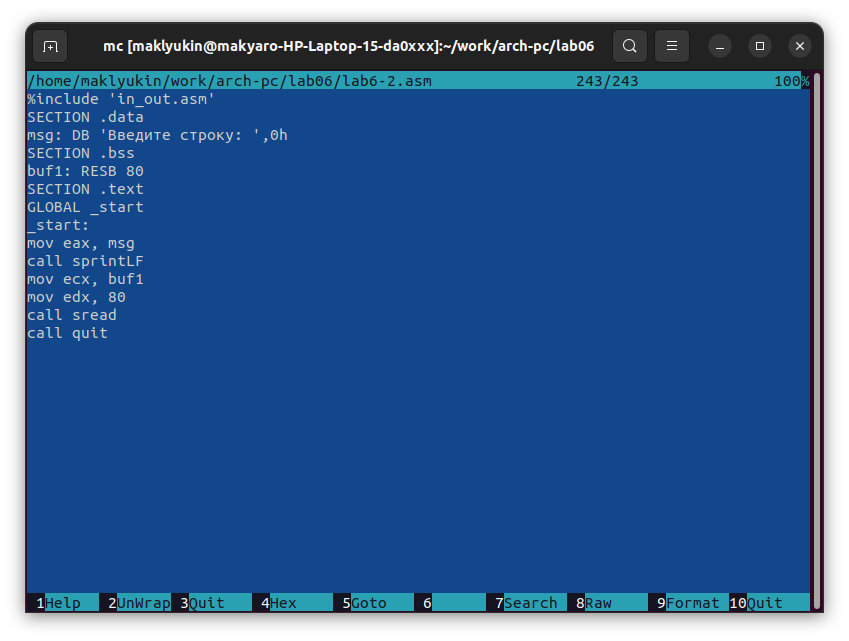

---
## Front matter
title: "Отчет по лабораторной работе № 6"
subtitle: "дисциплина: Архитектура компьютера"
author: "Клюкин Михаил Александрович"

## Generic otions
lang: ru-RU
toc-title: "Содержание"

## Bibliography
bibliography: bib/cite.bib
csl: pandoc/csl/gost-r-7-0-5-2008-numeric.csl

## Pdf output format
toc: true # Table of contents
toc-depth: 2
lof: true # List of figures
lot: true # List of tables
fontsize: 12pt
linestretch: 1.5
papersize: a4
documentclass: scrreprt
## I18n polyglossia
polyglossia-lang:
  name: russian
  options:
	- spelling=modern
	- babelshorthands=true
polyglossia-otherlangs:
  name: english
## I18n babel
babel-lang: russian
babel-otherlangs: english
## Fonts
mainfont: PT Serif
romanfont: PT Serif
sansfont: PT Sans
monofont: PT Mono
mainfontoptions: Ligatures=TeX
romanfontoptions: Ligatures=TeX
sansfontoptions: Ligatures=TeX,Scale=MatchLowercase
monofontoptions: Scale=MatchLowercase,Scale=0.9
## Biblatex
biblatex: true
biblio-style: "gost-numeric"
biblatexoptions:
  - parentracker=true
  - backend=biber
  - hyperref=auto
  - language=auto
  - autolang=other*
  - citestyle=gost-numeric
## Pandoc-crossref LaTeX customization
figureTitle: "Рис."
tableTitle: "Таблица"
listingTitle: "Листинг"
lofTitle: "Список иллюстраций"
lotTitle: "Список таблиц"
lolTitle: "Листинги"
## Misc options
indent: true
header-includes:
  - \usepackage{indentfirst}
  - \usepackage{float} # keep figures where there are in the text
  - \floatplacement{figure}{H} # keep figures where there are in the text
---

# Цель работы

Приобрести практические навыки работы в Midnight Commander. Освоить инструкции языка ассемблера mov и int

# Задание

1. Написать программы, которая печатает на экран "Hello world!".
2. Провести трансляцию и компоновку этой программы.
3. Написать программу, которая печатает на экран "Клюкин Михаил".
4. Провести трасляцию и компоновку этой программы.
5. Скопировать полученные файлы в локальный репозиторий, загрузить их на Github.

# Теоретическое введение

## Основны работы с Midnight Commander

Midnight commander - программа, которая позволяет просматривать структуру каталогов ии работать с файловой системой. Запустить Midnight Commander можно с помощью команды mc в терминале.

В Midnight Commander используются функциональные клавиши F1-F10, к которым привязаны часто выпоняемые операции. Также есть комбинации клавиш,  облегчающие работу.


## Структура программы на языке ассемблера NASM

Программа на на языке ассемблера NASM, как правило, состоит из трех чатей: секция кода программы (SECTION .text), секция инициированных, известных во время компиляции, данных (SECTION .data), секция неинициированных, тех, под которые во время компиляции только отводится память, а значение присваивается в ходе выполнения программы, данных (SECTION .bss).

Для объявления инициинованных данных используются директивы DB, DW, DD, DQ, DT, которые резерцируют память и указывают, какие значения должны храниться в памяти.

Директивы используются для объявления простых переменных и для объявления массивов. Для определения строк принято использовать директиву DB в связи с особенностями хранения данных оперативной памяти.

Синтаксис директив определения данных следующий:

```
<имя> DB <операнд> [, <операнд>] [, <операнд>]
```

Для объявления неинициированных данных в секции .bss используются директивы resb, resw, resd и другие, которые сообщают ассемблеру, что необходимо зарезервировать заданное количество ячеек памяти.

## Элементы программирования

### Описание инструкции mov

Инструкция mov предназначена для дублирования данных источника в приемнике. Общий вид инструкции:

```
mov dst, src
```

Операнд dst -- приемник, src -- источник. В качестве операнда могут выступать регистры, ячейки памяти и непосредственно значения.

Пересылать значение из одной ячейки памяти в другую нельзя. Для этого необходимо использовать две инструкции mov:

```
mov eax, x
mov y, eax
```

При этом размер операндов приемника и источника должны совпадать.

### Описание инструкции int

Инструкция int предназначена для вызова прерывания с указанным номером. Общий вид инструкции:

```
int n
```

Здесь n -- номер прерывания, принадлежащйи диапазону 0-255.

### Системные вызовы для обеспечения диалога с пользователем

Для вывода строки на экран используется системный вызов write. Этот системный вызов имеет номер 4, поэтому перед вызовом интсрукции int необходимо поместить значение 4 в регистр eax. Первым аргументом write, помещаемым в регистр ebx, задаётся дескриптор файла. Для вывода на экран в качестве дескриптора файла нужно указать 1. Вторым аргументом задаётся адрес выводимой строки (помещаем его в регистр ecx, например, инструкцией mov ecx, msg). Строка может иметь любую длину. Последним аргументом (т.е. в регистре edx) должна задаваться максимальная длина выводимой строки.

Для ввода строки с клавиатуры используется системный вызов read. Он имеет такие же аргументы как и write, только для чтения с клавиатуры используется файловый дескриптор 0.

Системынй вызов exit является обязательным в конце любой программы.  Для обозначения конца программы перед вызовом инструкции int 80h необходимо поместить в регистр еах значение 1, а в регистр ebx код завершения 0.

# Выполнение лабораторной работы

Открыли Midnight Commander, перешли в каталог ~/work/arch-pc. С помощью функциональной клавиши F7 создали папку lab06, перешли в нее и, пользуясь строкой ввода и командой touch, создали файл lab6-1.asm (Рис. [-@fig:fig1]).

{ #fig:fig1 width=70% }

С помощью функциональной клавиши F4 открыли файл lab6-1.asm для редактирования в редакторе nano. Ввели текст программы (Рис. [-@fig:fig2]).

{ #fig:fig2 width=70% }

С помощью функциональной клавиши F3 открыли файл lab6-1.asm и убедились, что он содержит текст программы (Рис. [-@fig:fig3]).

{ #fig:fig3 width=70% }

Оттранслировали текст программы lab6-1.asm в объектный файл. Выполнили компоновку объектного файла и запустили получившийся исполняемый файл (Рис. [-@fig:fig4]).

{ #fig:fig4 width=70% }

## Подключение внешнего файла in_out.asm

Скачали файл in_out.asm со страницы курса в ТУИС.

Скопировали файл in_out.asm в каталог с файлом lab6-1.asm с помощью функциональной клавиши F5 (Рис. [-@fig:fig5]).

{ #fig:fig5 width=70% }

С помощью функциональной клавиши F6 создали копию файла lab6-1.asm (Рис. [-@fig:fig6]).

{ #fig:fig6 width=70% }

Изменили текст программы в файле lab6-2.asm. В ней использовали подпрограммы из внешнего файла in_out.asm (Рис. [-@fig:fig7]).

{ #fig:fig7 width=70% }

Создали исполняемый файл и проверили его работу (Рис. [-@fig:fig8]).

{ #fig:fig8 width=70% }

В файле lab6-2.asm заменили подпрограмму sprintLF на sprint. Создали исполняемый файл и проверили его работу (Рис. [-@fig:fig9]).

{ #fig:fig9 width=70% }

Подпрограмма sprint, в отличие от sprintLF, не делает переход на новую строку после фразы "Введите строку:".


# Выполнение заданий для самостоятельной работы


# Контрольные вопросы для самопроверки


# Выводы


# Список литературы{.unnumbered}

1. Демидова А. В. Лабораторная работа №5. Создание и процесс обработки программ на языке ассемблера NASM – Методическое пособие
