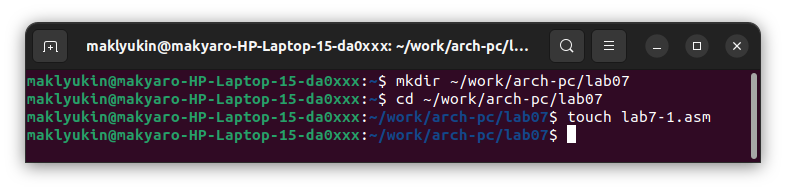
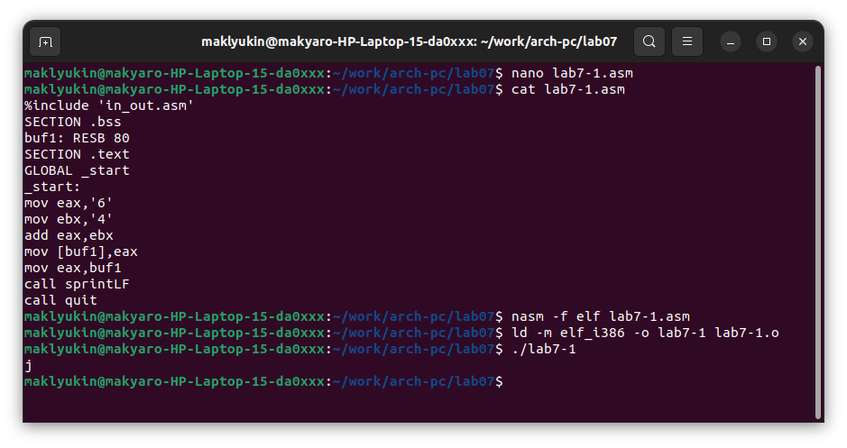
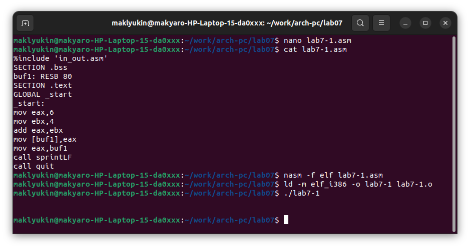
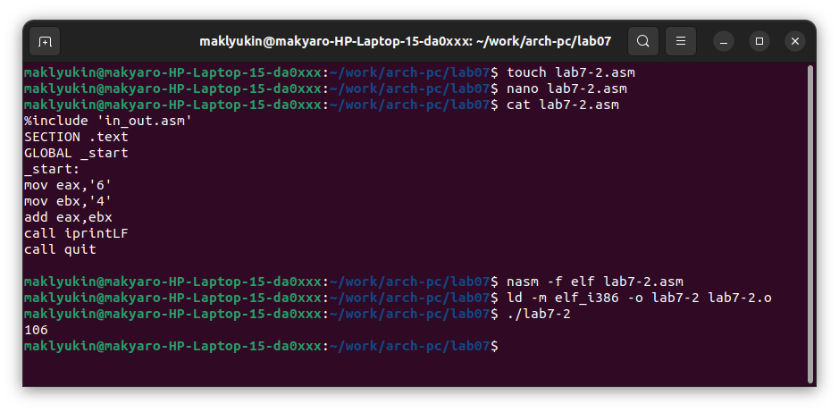
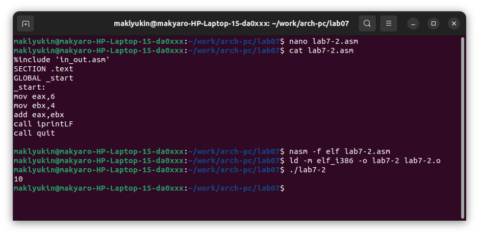
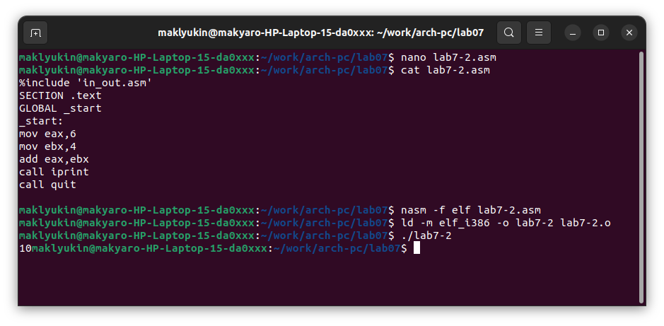
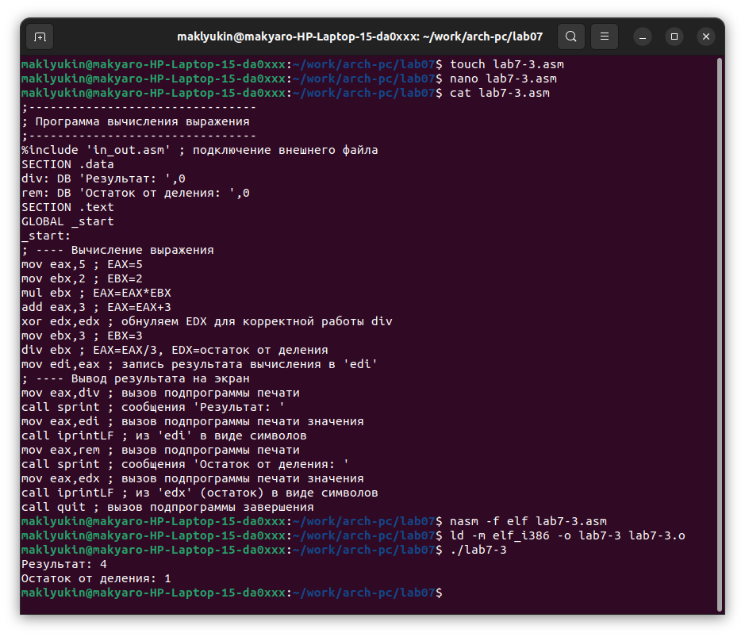
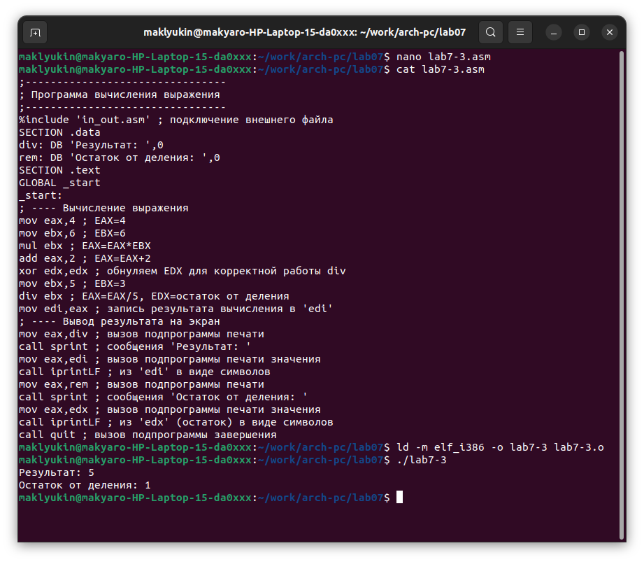
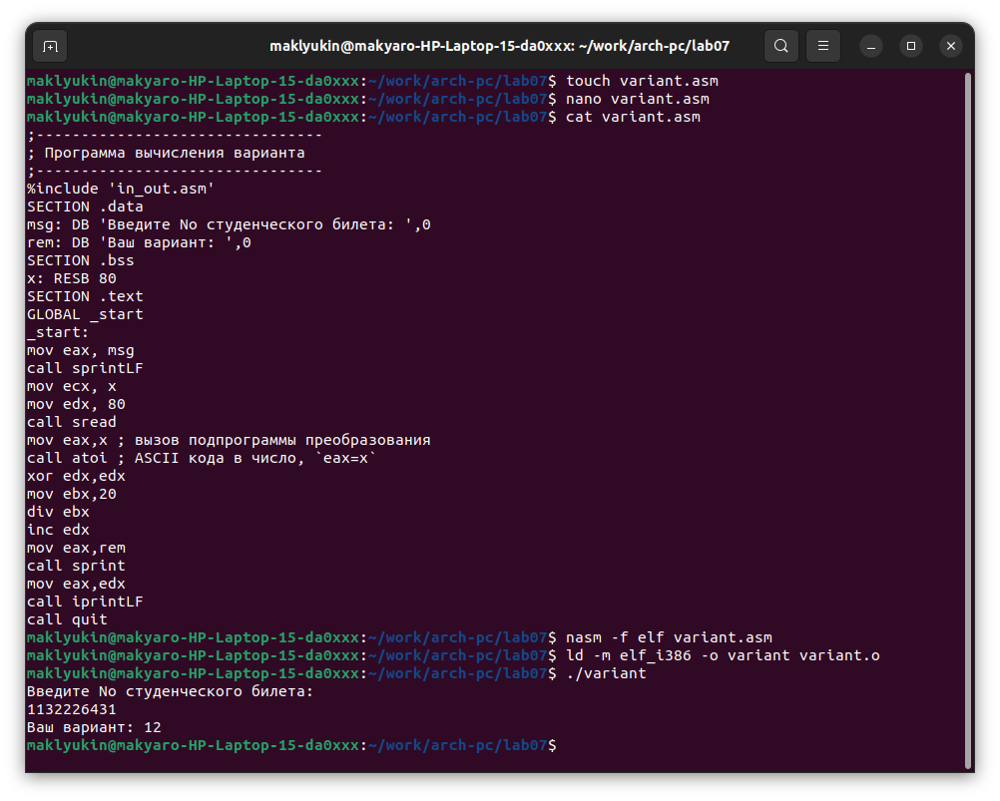
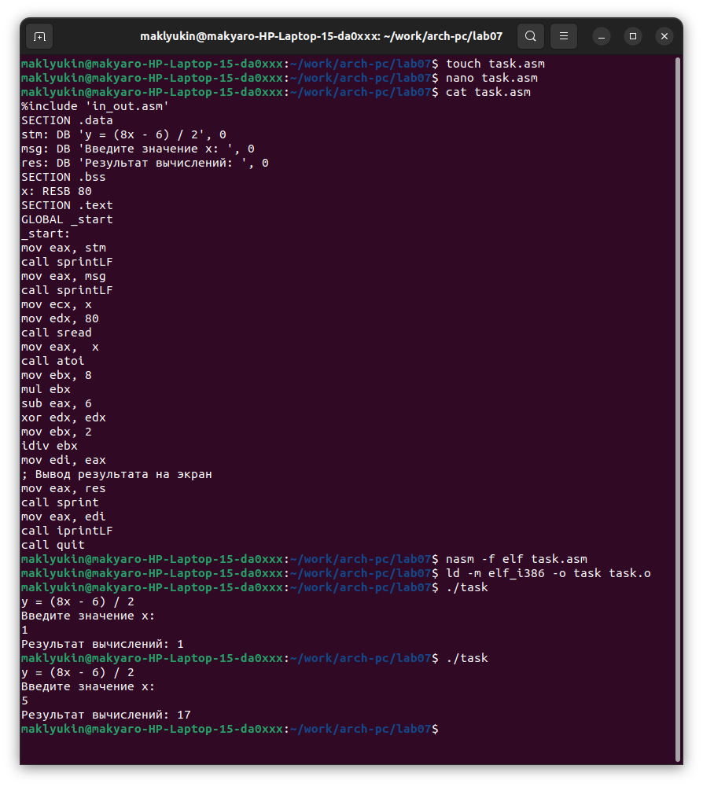

---
## Front matter
title: "Отчет по лабораторной работе № 7"
subtitle: "дисциплина: Архитектура компьютера"
author: "Клюкин Михаил Александрович"

## Generic otions
lang: ru-RU
toc-title: "Содержание"

## Bibliography
bibliography: bib/cite.bib
csl: pandoc/csl/gost-r-7-0-5-2008-numeric.csl

## Pdf output format
toc: true # Table of contents
toc-depth: 2
lof: true # List of figures
lot: true # List of tables
fontsize: 12pt
linestretch: 1.5
papersize: a4
documentclass: scrreprt
## I18n polyglossia
polyglossia-lang:
  name: russian
  options:
	- spelling=modern
	- babelshorthands=true
polyglossia-otherlangs:
  name: english
## I18n babel
babel-lang: russian
babel-otherlangs: english
## Fonts
mainfont: PT Serif
romanfont: PT Serif
sansfont: PT Sans
monofont: PT Mono
mainfontoptions: Ligatures=TeX
romanfontoptions: Ligatures=TeX
sansfontoptions: Ligatures=TeX,Scale=MatchLowercase
monofontoptions: Scale=MatchLowercase,Scale=0.9
## Biblatex
biblatex: true
biblio-style: "gost-numeric"
biblatexoptions:
  - parentracker=true
  - backend=biber
  - hyperref=auto
  - language=auto
  - autolang=other*
  - citestyle=gost-numeric
## Pandoc-crossref LaTeX customization
figureTitle: "Рис."
tableTitle: "Таблица"
listingTitle: "Листинг"
lofTitle: "Список иллюстраций"
lotTitle: "Список таблиц"
lolTitle: "Листинги"
## Misc options
indent: true
header-includes:
  - \usepackage{indentfirst}
  - \usepackage{float} # keep figures where there are in the text
  - \floatplacement{figure}{H} # keep figures where there are in the text
---

# Цель работы

Освоить арифметические инструкции языка ассемблера NASM. 

# Задание

1. Создать и исполнить программу для вычисления суммы $6 + 4$.
2. Создать программу и исполнить для вычисления выражения $(5 * 2 + 3) / 3$.
3. Создать программу и исполнить для вычисления выражения $(4 * 6 + 2) / 5$.
4. Создать программу и исполнить для вычисления номера варианта по номеру студентческого билета.
5. Ответить на вопросы.
6. Выполнить задание для самостоятельной работы.

# Теоретическое введение

## Адресация в NASM

Адрес операнда предоставляет место, в котором хранятся данные для обработки. Данные могут хранится в регистре или в ячейке памяти.   
Существуют три способа адресации:

* Регистровая адресация -- операнды хранятся в регистрах и в команде используются имена этих регистров.
*  Непосредственная адресация -- значения операндов хранятся непосредственно в команде.
* Адресация памяти -- операнд задает адрес памяти. В команде указывается обозначение ячейки памяти, над содержимым которой требуется выполнить операцию.


## Арифметические операции в NASM

### Целочисленное сложение add

Команда add выпоняет сложение двух опеарндов и записывает результат по адресу первого операнда. Она выглядит следующим образом:

```
add <операнд_1>, <операнд_2>
```

Допустимые сочетания операндов для команды add аналогичны сочетаниям операндов для команды mov.

### Целочисленное вычитание sub

Работает аналогично команде add и выглядит следующим образом:
```
sub <операнд_1>, <операнд_2>
```

### Команды инкремента и декремента

Инкремент -- прибавление единицы, декремент -- вычитание единицы. Команды для этих операций имеют следующий вид:

```
inc <операнд>
dec <операнд>
```

Операндом может быть регистр или ячейка памяти любого размера

### Команды умножения mul и imul

Для беззнакового умножения используется команда mul:

```
mul <операнд>
```

Для знакового умножения используется команда imul:

```
imul <операнд>
```

Для команд умножения один из сомножителей указывается в команде и должен находиться в регистре или в памяти, но не может быть непосредственным операндом. Второй сомножитель в команде явно не указывается и должен находиться в регистре EAX,AX или AL, а результат помещается в регистры EDX:EAX, DX:AX или AX, в зависимости от размера операнда.

Примеры использования инструкции mul:
```
a dw 270

mov ax, 100
mul a
mul bl
mul ax
```

### Команда деления div idiv

Для беззнакового деления используется команда div:
```
div <делитель>
```

Для знакового деления используется команда idiv:
```
idiv <делитель>
```

В командах указывается только один операнд – делитель, который может быть регистром или ячейкой памяти, но не может быть непосредственным операндом. Местоположение делимого и результата для команд деления зависит от размера делителя. Кроме того, так как в результате деления получается два числа – частное и остаток, то эти числа помещаются в определённые регистры.

## Перевод символа числа в десятичную символьную запись

Ввод информации с клавиатуры и вывод её на экран осуществляется в символьном виде. Кодирование этой информации производится согласно кодовой таблице символов ASCII. ASCII – сокращение от American Standard Code for Information Interchange (Американский стандартный код для обмена информацией). Согласно стандарту ASCII каждый символ кодируется одним байтом. Расширенная таблица ASCII состоит из двух частей. Первая (символы с кодами 0-127) является универсальной (см. Приложение.), а вторая (коды 128-255) предназначена для специальных символов и букв национальных алфавитов и на компьютерах разных типов может меняться. Среди инструкций NASM нет такой, которая выводит числа (не в символьном виде). Поэтому, например, чтобы вывести число, надо предварительно преобразовать его цифры в ASCII-коды этих цифр и выводить на экран эти коды, а не само число. Если же выводить число на экран непосредственно, то экран воспримет его не как число, а как последовательность ASCII-символов – каждый байт числа будет воспринят как один ASCII-символ – и выведет на экран эти символы. Аналогичная ситуация происходит и при вводе данных с клавиатуры. Введенные данные будут представлять собой символы, что сделает невозможным получение корректного результата при выполнении над ними арифметических операций. Для решения этой проблемы необходимо проводить преобразование ASCII символов в числа и обратно. Для выполнения лабораторных работ в файле in_out.asm реализованы подпрограммы для преобразования ASCII символов в числа и обратно. Это:

* iprint -- вывод на экран чисел в формате ASCII, перед вызовом iprint в регистр eax необходимо записать выводимое число (mov eax,<int>).
* iprintLF -- работает аналогично iprint, но при выводе на экран после числа добавляет к символ перевода строки.
* atoi -- функция преобразует ascii-код символа в целое число и записает результат в регистр eax, перед вызовом atoi в регистр eax необходимо записать число (mov eax,<int>).\

# Выполнение лабораторной работы

## Символьные и численные данные в NASM

Создали каталог для работы и перешли в него. Создали файл lab7-1.asm (Рис. [-@fig:fig1]).

{ #fig:fig1 width=70% }

Ввели в файл lab7-1.asm текст следующей программы:
```
%include 'in_out.asm'
SECTION .bss
buf1: RESB 80
SECTION .text
GLOBAL _start
_start:
mov eax,'6'
mov ebx,'4'
add eax,ebx
mov [buf1],eax
mov eax,buf1
call sprintLF
call quit
```

Создали исполняемый файл и запустили его (Рис. [-@fig:fig2]).

{ #fig:fig2 width=70% }

В результате мы получили не число 10, а символ 'j', поскольку команда add записала в регистр eax сумму кодов символов '4' и '6', которая является кодом символа 'j'.

Далее заменили в тексте программы символы на числа, создали исполняемый файл и запустили его (Рис. [-@fig:fig3]).

{ #fig:fig3 width=70% }

В этом случае мы так же не получили число 10. Вместо него выводится символ с кодом 10 -- '\\n', который не отображается при выводе на экран.

Создали файл lab7-2.asm в каталоге ~/work/arch-pc/lab07 и ввели в него текст следующей программы:
```
%include 'in_out.asm'
SECTION .text
GLOBAL _start
_start:
mov eax,'6'
mov ebx,'4'
add eax,ebx
call iprintLF
call quit
```
Создали и запустили исполняемый файл (Рис. [-@fig:fig4]).

{ #fig:fig4 width=70% }

В результате получили число 106, так как функция iprintLF позволяет вывести число, а не символ, кодом которого является это число.

Заменили в тексте программы символы на числа, создали исполняемый файл и запустили его (Рис. [-@fig:fig5]).

{ #fig:fig5 width=70% }

В результате работы программы на экран вывелось число 10.

Заменили функцию iprintLF на iprint, создали исполняемый файл и запустили его (Рис. [-@fig:fig6]).

{ #fig:fig6 width=70% }

В результате после вывода числа 10 не произошло перехода на новую строку. Этим вывод функции iprint отличается от вывода функции iprintLF.

## Выполнение арифметических операций в NASM

Создали файл lab7-3.asm, ввели в него текст программы для вычисления выражения $f(x) = (5 * 2 + 3) / 3$ (Рис. [-@fig:fig7]):
```
;--------------------------------
; Программа вычисления выражения
;--------------------------------
%include 'in_out.asm' ; подключение внешнего файла
SECTION .data
div: DB 'Результат: ',0
rem: DB 'Остаток от деления: ',0
SECTION .text
GLOBAL _start
_start:
; ---- Вычисление выражения
mov eax,5 ; EAX=5
mov ebx,2 ; EBX=2
mul ebx ; EAX=EAX*EBX
add eax,3 ; EAX=EAX+3
xor edx,edx ; обнуляем EDX для корректной работы div
mov ebx,3 ; EBX=3
div ebx ; EAX=EAX/3, EDX=остаток от деления
mov edi,eax ; запись результата вычисления в 'edi'
; ---- Вывод результата на экран
mov eax,div ; вызов подпрограммы печати
call sprint ; сообщения 'Результат: '
mov eax,edi ; вызов подпрограммы печати значения
call iprintLF ; из 'edi' в виде символов
mov eax,rem ; вызов подпрограммы печати
call sprint ; сообщения 'Остаток от деления: '
mov eax,edx ; вызов подпрограммы печати значения
call iprintLF ; из 'edx' (остаток) в виде символов
call quit ; вызов подпрограммы завершения
```

Создали исполняемый файл и запустили его (Рис. [-@fig:fig7]).

{ #fig:fig7 width=70% }

Изменили текст программы для вычисления выражения $f(x) = (4*6 + 2) / 5$, создали исполняемый файл и проверили его работу (Рис. [-@fig:fig8]).

{ #fig:fig8 width=70% }

Создали файл variant.asm, ввели в него текст программы для вычисления номера варианта по номеру студентческого билета по формуле $(S_n mod 20) + 1$ (Рис. [-@fig:fig9]):
```
;--------------------------------
; Программа вычисления варианта
;--------------------------------
%include 'in_out.asm'
SECTION .data
msg: DB 'Введите No студенческого билета: ',0
rem: DB 'Ваш вариант: ',0
SECTION .bss
x: RESB 80
SECTION .text
GLOBAL _start
_start:
mov eax, msg
call sprintLF
mov ecx, x
mov edx, 80
call sread
mov eax,x ; вызов подпрограммы преобразования
call atoi ; ASCII кода в число, `eax=x`
xor edx,edx
mov ebx,20
div ebx
inc edx
mov eax,rem
call sprint
mov eax,edx
call iprintLF
call quit
```

Создали исполняемый файл и запустили его (Рис. [-@fig:fig9]).

{ #fig:fig9 width=70% }

За вывод на экран сообщения 'Ваш вариант:' отвечают следующие строки:
```
mov eax, rem
call sprint
```

Инструкция 'mov ecx, x' пересылает в регистр 'ecx' значение переменной 'x'.

Инструкция 'mov edx, 80' используется для  записи в регистр 'eax' числа '80'.

Инструкция 'call sread' используется для вызова функции sread

Инструкция 'call atoi' используется для вызова функции atoi

Для вычисления варианта используются следующие строки:
```
xor edx,edx
mov ebx,20
div ebx
inc edx
```

При выполнении инструкции 'div ebx' остаток от деления записывается в регистр 'ebx'

Инструкция 'inc edx' используется для увеличения значения регситра 'edx' на 1

За вывод на экран результатов вычислений отвечают следующие строки:
```
call iprintLF
```

# Выполнение заданий для самостоятельной работы

Написали программу для вычисления выражения $y = (8x - 6) / 2$:
```
%include 'in_out.asm'
SECTION .data
stm: DB 'y = (8x - 6) / 2', 0
msg: DB 'Введите значение x: ', 0
res: DB 'Результат вычислений: ', 0
SECTION .bss
x: RESB 80
SECTION .text
GLOBAL _start
_start:
mov eax, stm
call sprintLF
mov eax, msg
call sprintLF
mov ecx, x
mov edx, 80
call sread
mov eax,  x
call atoi
mov ebx, 8
mul ebx
sub eax, 6
xor edx, edx
mov ebx, 2
idiv ebx
mov edi, eax
; Вывод результата на экран
mov eax, res
call sprint
mov eax, edi
call iprintLF
call quit
```

Эта программа выводит выражение для вычисления, выводит запрос на ввод значения $x$, вычисляет заданное выражение в зависимости от введенного $x$ (Рис. [-@fig:fig10]). 

{ #fig:fig10 width=70% }

Создали исполняемый файл и проверили его работу для значений $X_1 = 1, x_2 = 5$ (Рис. [-@fig:fig10]).

# Контрольные вопросы для самопроверки

1. Какой синтаксис команды сложения чисел?

```
add <операнд_1>, <операнд_2>
```

2. Какая команда выполняет умножение без знака?

Умножение без знака выполняет команда 'mul'.

3. Какой синтаксис команды деление чисел без знака?

```
div <делитель>
```
Делитель может быть регистром или ячейкой памяти, но не может быть непосредственным операндом.  

4. Куда помещается результат при умножении двухбайтовых операндов?

Результат помещается в регистры 'DX:AX'  

5. Перечислите арифметические команды с целочисленными операндами и дайте их назначение.

* add -- выполняет сложение двух операндов и записывает результат по адресу первого операнда  
* sub -- выполняет вычитание второго опеаранда из первого и записывает результат по адресу первого операнда  
* inc -- увеличение значения операнда на единицу  
* dec -- уменьшение значения операнда на единицу  
* neg -- меняет знак операнда на противоположный  
* mul -- беззнаковое умножение операнда на множитель, находящийся в регистре 'EAX', 'AX' или 'AL'  
* imul -- умножение с учетом знака операнда на множитель, находящийся в регистре 'EAX', 'AX' или 'AL'  
* div -- беззнаковое деление делимого, находящегося в регистрах 'AX', 'DX:AX' или 'EDX:EAX', на делитель   
* idiv -- деление с учетом знака делимого, находящегося в регистрах 'AX', 'DX:AX' или 'EDX:EAX', на делитель   

6. Где находится делимое при целочисленном делении операндов?

Местоположение делимого при целочисленном делении зависит от размера делителя. Так делимое может находиться в регистрах 'AX' (размер делителя 1 байт), 'DX:AX' (размер делителя 2 байта), 'EDX: EAX' (размер делителя 4 байта).

7. Куда помещаются неполное частное и остаток при делении целочисленных операндов?

При целочисленном делении частное и остаток помещаются соответсвенно в регистры 'AL', 'AH', если размер делителя 1 байт, регистры 'AX', 'DX', если размер делителя 2 байта, регистры 'EAX', 'EDX', если размер делителя 4 байта.  

# Выводы

Освоили арифметические инструкции языка ассемблера NASM.

# Список литературы{.unnumbered}

1. Демидова А. В. Лабораторная работа №7. Арифметические операции в NASM – Методическое пособие
